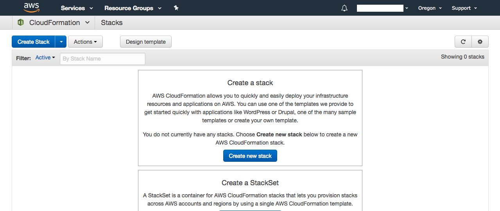
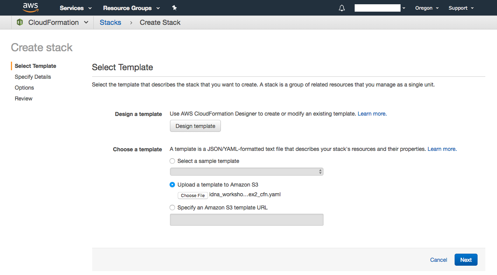
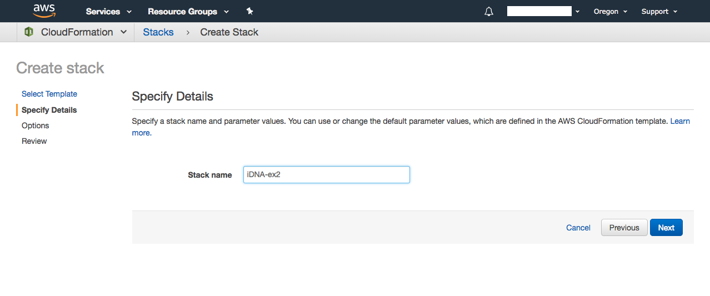
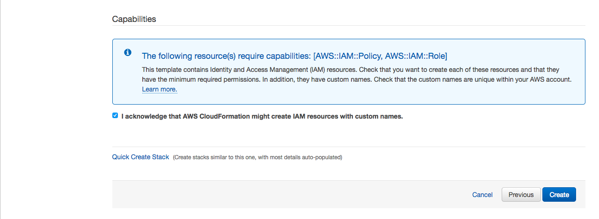
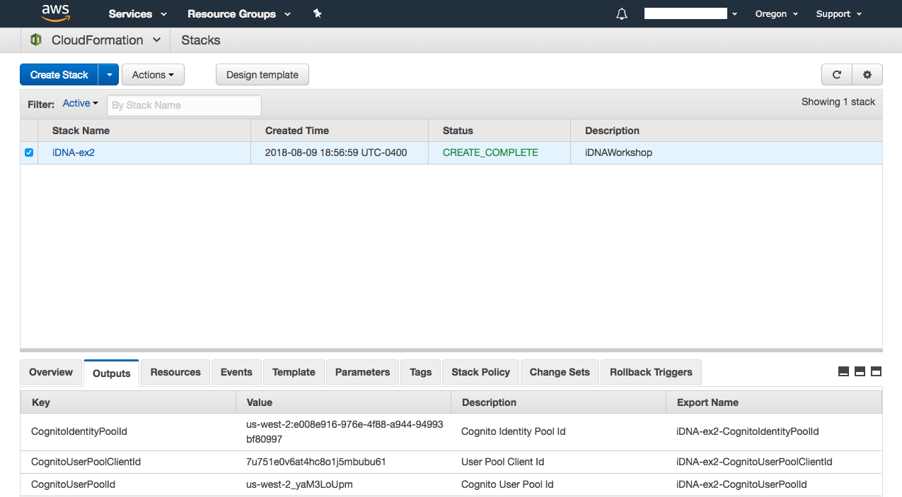

# About

This exercise will walk you through a scenario of using Amazon Cognito to setup a Web Identity provider (like Amazon or Facebook) and the hosted UI to allow users to authenticate to your new application. We will also show how to create your own UI using the Amazon Cognito api to perform the same function.

# Setup - Manual

TODO

# Setup - Cloud Formation
Follow this steps to create the resources using the provided CloudFormation template:
1. Go to the CloudFormation console and click "Create new stack"

2. Select "Upload a template to Amazon S3", pick the provided template for the exercise 2 (idna_workshop_ex2_cfn.yaml), and click "Next"

3. Provide a name for your Stack, for example "iDNA-ex2" and click "Next"

4. Click "Next" again
5. Acknowledge that AWS CloudFormation might create IAM resources and click "Create"

6. After the Stack is created go to the "Outputs" section of the Stack and note the keys displayed.

# Setup - Web Identity

# Junk

Domain: https://idna.auth.us-east-1.amazoncognito.com

To Sign In: https://idna.auth.us-east-1.amazoncognito.com/login?response_type=token&client_id=1ga8qjvieiuias7h163f4tqp0j&redirect_uri=https://node-alb-one-1981137585.us-east-1.elb.amazonaws.com/api/echo/get

https://your_domain/login?response_type=[code|token]&client_id=your_app_client_id&redirect_uri=your_callback_url

https://node-alb-one-1981137585.us-east-1.elb.amazonaws.com/api/echo/get

URL REQUEST Made usin callback url
