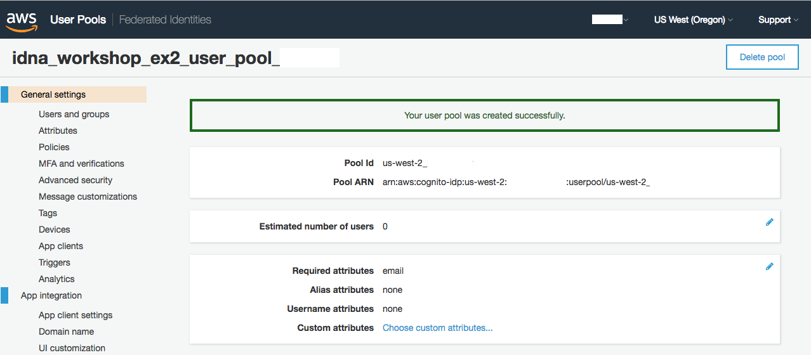

# About

This exercise will walk you through a scenario of using Amazon Cognito to setup a Web Identity provider (like Amazon or Facebook) and the hosted UI to allow users to authenticate to your new application. We will also show how to create your own UI using the Amazon Cognito API to perform the same function.

# Setup Amazon Cognito user pool and identity pool
The first step in this exercise is to setup the foundational pieces of the Amazon Cognito infrastructure, meaning the User Pool (CUP) and the Identity Pool (CIP), manual instructions or a CloudFormation based intructions are provided.

## Setup - Manual

Follow this steps to manually create the CUP and the CIP:
1. Go to the Amazon Cognito console and click the "Manage User Pools" button

2. Click "Create a user pool"

3. Name your user pool, for example "idna_workshop_ex2_user_pool_XYZ", where "XYZ" is an unique text for you (username, etc). Then click "Review defaults"

4. Click "Add app client"

5. Click "Add an app client"

6. Name your App Client, for example "idna_workshop_ex2_client_XYZ", where "XYZ" is an unique text for you. Then click "Create app client"

7. Click "Return to pool details"

8. Click "Create pool"

9. Once your CUP was create copy the "Pool Id", also go to the "App client settings" under the "App Integration" section to copy the App Client ID (placed under the App Client name)

10. Click "Federated Identities" next to the AWS logo

11. Name your Identity Pool, for example "idna_workshop_ex2_identity_pool_XYZ", where "XYZ" is an unique text for you. Then click "Authentication providers"

12. Paste the values for the Cognito User Pool that you copied on step 9 and click "Create Pool"

13. Click "View Details"

14. Click "Edit" to change the policy for authenticated users

15. Set the "Action" to "*" and click "Allow"

16. Your Cognito Identity Pool should be ready to use.

## Setup - Cloud Formation

Follow this steps to create the resources using the provided CloudFormation template:
1. Go to the CloudFormation console and click "Create new stack"

2. Select "Upload a template to Amazon S3", pick the provided template for the exercise 2 (idna_workshop_ex2_cfn.yaml), and click "Next"

3. Provide a name for your Stack, for example "iDNA-ex2" and click "Next"

4. Click "Next" again
5. Acknowledge that AWS CloudFormation might create IAM resources and click "Create"

6. After the Stack is created go to the "Outputs" section of the Stack and note the keys displayed.

# Setup - Web Identity

# Junk

Domain: https://idna.auth.us-east-1.amazoncognito.com

To Sign In: https://idna.auth.us-east-1.amazoncognito.com/login?response_type=token&client_id=1ga8qjvieiuias7h163f4tqp0j&redirect_uri=https://node-alb-one-1981137585.us-east-1.elb.amazonaws.com/api/echo/get

https://your_domain/login?response_type=[code|token]&client_id=your_app_client_id&redirect_uri=your_callback_url

https://node-alb-one-1981137585.us-east-1.elb.amazonaws.com/api/echo/get

URL REQUEST Made usin callback url
